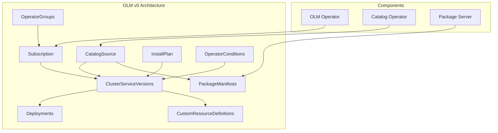
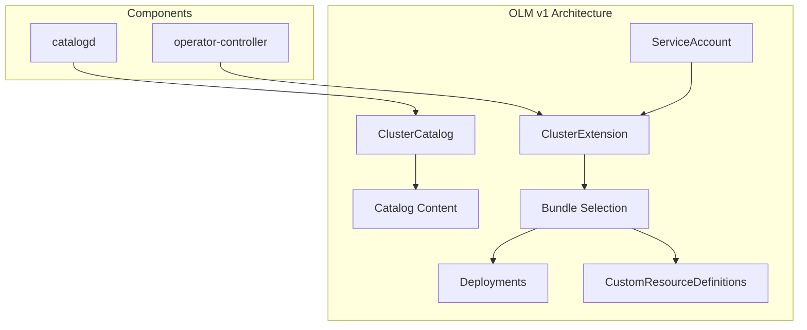

# OLM v0 vs OLM v1: Technical Study and Testing Evolution

## Abstract

This document provides a comprehensive technical analysis of the Operator Lifecycle Manager (OLM) evolution from v0 to v1, examining architectural differences, API changes, testing methodologies, and their impact on Red Hat Developer Hub (RHDH) operator verification. This study serves as both a technical reference and practical guide for understanding the migration implications for operator teams.

## Table of Contents

1. [Introduction and Background](#introduction-and-background)
2. [OLM v0 Architecture and Components](#olm-v0-architecture-and-components)
3. [OLM v1 Architecture and Components](#olm-v1-architecture-and-components)
4. [Technical Differences Analysis](#technical-differences-analysis)
5. [Testing Methodology Evolution](#testing-methodology-evolution)
6. [RHDH Operator Verification Case Study](#rhdh-operator-verification-case-study)
7. [Migration Strategies and Best Practices](#migration-strategies-and-best-practices)
8. [Conclusion and Recommendations](#conclusion-and-recommendations)

---

## 1. Introduction and Background

### 1.1 Problem Statement

The Operator Lifecycle Manager (OLM) v1 was released as GA in OpenShift Container Platform (OCP) 4.18, representing a ground-up redesign to address fundamental limitations in OLM v0. This transition requires all Red Hat layered product operators to verify compatibility with OLM v1 APIs before the August 22, 2025 deadline to ensure seamless customer experience on OCP 4.20+.

### 1.2 Scope and Objectives

This study aims to:
- Provide deep technical understanding of OLM v0 vs v1 architectural differences
- Analyze API changes and their implications for operator development
- Document testing methodology evolution from traditional OLM v0 to OLM v1 verification
- Present practical verification approach using RHDH operator as a case study
- Establish best practices for operator teams transitioning to OLM v1 support

### 1.3 Key Terminology

- **FBC (File-Based Catalog)**: Modern catalog format used by both OLM versions
- **ClusterExtension**: OLM v1's primary installation API, replacing Subscription
- **ClusterCatalog**: OLM v1's catalog source API, replacing CatalogSource
- **Bundle**: Packaged operator manifests (CSV, CRDs, etc.)
- **Channel**: Version stream within an operator package
- **CSV (ClusterServiceVersion)**: Operator metadata and deployment specification

---

## 2. OLM v0 Architecture and Components

### 2.1 Core Components

OLM v0 consists of several key components working together:



### 2.2 Key APIs and Resources

#### CatalogSource
```yaml
apiVersion: operators.coreos.com/v1alpha1
kind: CatalogSource
metadata:
  name: redhat-operators
  namespace: openshift-marketplace
spec:
  sourceType: grpc
  image: registry.redhat.io/redhat/redhat-operator-index:v4.19
  displayName: Red Hat Operators
  publisher: Red Hat
```

#### Subscription
```yaml
apiVersion: operators.coreos.com/v1alpha1
kind: Subscription
metadata:
  name: rhdh-operator
  namespace: rhdh-operator
spec:
  channel: fast
  name: rhdh
  source: redhat-operators
  sourceNamespace: openshift-marketplace
```

#### OperatorGroup
```yaml
apiVersion: operators.coreos.com/v1
kind: OperatorGroup
metadata:
  name: rhdh-operator
  namespace: rhdh-operator
spec:
  targetNamespaces:
  - rhdh-operator
```

### 2.3 Installation Flow

1. **Catalog Registration**: CatalogSource points to operator index image
2. **Package Discovery**: Package Server aggregates available operators
3. **Subscription Creation**: User creates Subscription targeting specific channel
4. **Dependency Resolution**: OLM resolves operator dependencies automatically
5. **InstallPlan Generation**: OLM creates InstallPlan with required resources
6. **CSV Installation**: ClusterServiceVersion deployed to target namespace
7. **Operator Deployment**: CSV creates operator Deployment and RBAC

### 2.4 Channel and Upgrade Management

OLM v0 uses complex channel semantics:
- **Default Channel**: Fallback when no channel specified
- **Channel Precedence**: Complex rules for multi-channel packages
- **Upgrade Edges**: `replaces`, `skips`, `skipRange` determine upgrade paths
- **Automatic Updates**: Subscriptions can auto-upgrade within channels

---

## 3. OLM v1 Architecture and Components

### 3.1 Simplified Architecture

OLM v1 dramatically simplifies the architecture:



### 3.2 Key APIs and Resources

#### ClusterCatalog
```yaml
apiVersion: olm.operatorframework.io/v1
kind: ClusterCatalog
metadata:
  name: rhdh-catalog
spec:
  source:
    type: Image
    image:
      ref: quay.io/rhdh/iib:1.7-v4.20-x86_64
```

#### ClusterExtension
```yaml
apiVersion: olm.operatorframework.io/v1
kind: ClusterExtension
metadata:
  name: rhdh
spec:
  namespace: rhdh-system
  serviceAccount:
    name: rhdh-installer
  source:
    sourceType: Catalog
    catalog:
      packageName: rhdh
      version: ">=1.7.0 <1.8.0"
```

### 3.3 Installation Flow

1. **Catalog Registration**: ClusterCatalog references FBC image directly
2. **Catalog Unpacking**: catalogd extracts and serves catalog content
3. **Extension Creation**: User creates ClusterExtension with version constraints
4. **Bundle Resolution**: operator-controller selects best matching bundle
5. **Direct Installation**: Controller installs bundle content directly
6. **Lifecycle Management**: Controller manages operator lifecycle

### 3.4 Version Selection Algorithm

OLM v1 uses semantic versioning with clear precedence:
1. **Semantic Version Ordering**: Higher semver versions preferred
2. **Deprecation Awareness**: Non-deprecated bundles prioritized
3. **Constraint Matching**: Version ranges filter available bundles
4. **Upgrade Path Inclusion**: All edges considered (unlike OLM v0)

---

## 4. Technical Differences Analysis

### 4.1 API Comparison Matrix

| Aspect | OLM v0 | OLM v1 | Impact |
|--------|--------|--------|---------|
| **Catalog API** | CatalogSource | ClusterCatalog | Simplified, image-based only |
| **Installation API** | Subscription | ClusterExtension | Explicit, declarative |
| **Namespace Scoping** | OperatorGroup | ServiceAccount | Improved isolation |
| **Dependency Resolution** | Automatic | Manual | Explicit control |
| **Channel Concept** | Central | Advisory | Simplified semantics |
| **Upgrade Edges** | Complex rules | All edges valid | More predictable |
| **Default Channel** | Required | Not applicable | Eliminates confusion |

### 4.2 Removed Features

#### OperatorConditions API
```yaml
# OLM v0 - No longer supported in v1
apiVersion: operators.coreos.com/v1
kind: OperatorCondition
metadata:
  name: rhdh-operator.v1.7.0
spec:
  conditions:
  - type: Upgradeable
    status: "True"
```

**Implications:**
- Operators cannot signal upgrade readiness
- No `OPERATOR_CONDITIONS_NAME` environment variable
- Operators must handle upgrades gracefully without external signals

#### Automatic Dependency Resolution
- OLM v1 does not automatically resolve operator dependencies
- Teams must explicitly install required operators
- Simplifies installation but requires more manual coordination

### 4.3 Enhanced Features

#### Namespace Isolation
```yaml
# OLM v1 encourages isolated namespaces
spec:
  namespace: rhdh-system  # Dedicated namespace
  serviceAccount:
    name: rhdh-installer  # Scoped permissions
```

#### Version Constraints
```yaml
# More flexible version selection
catalog:
  packageName: rhdh
  version: ">=1.7.0 <2.0.0"  # Semantic ranges
  channel: fast              # Advisory only
```

---

## 5. Testing Methodology Evolution

### 5.1 Traditional OLM v0 Testing

#### Integration Testing Approach
```bash
# Traditional operator installation
oc create namespace rhdh-operator
oc create -f operator-group.yaml
oc create -f subscription.yaml

# Wait for CSV to be installed
oc wait csv rhdh-operator.v1.7.0 --for=condition=Succeeded

# Create operator instance
oc create -f backstage-cr.yaml

# Run test suite
./run-integration-tests.sh
```

#### E2E Testing Pattern
```yaml
# Traditional test manifest structure
apiVersion: operators.coreos.com/v1alpha1
kind: Subscription
metadata:
  name: rhdh-operator
spec:
  channel: fast
  name: rhdh
  source: redhat-operators
  sourceNamespace: openshift-marketplace
  installPlanApproval: Automatic
```

### 5.2 OLM v1 Testing Methodology

#### Verification Testing Approach
```bash
# OLM v1 verification pattern
oc apply -f rhdh-olmv1-manifest.yaml

# Monitor ClusterExtension status
oc get clusterextension rhdh -w

# Verify installation success
oc describe clusterextension rhdh

# Create operator instance
oc create -f backstage-cr.yaml

# Run existing test suites
./run-integration-tests.sh
```

#### Modern Test Manifest Structure
```yaml
# OLM v1 verification manifest
---
apiVersion: v1
kind: Namespace
metadata:
  name: rhdh-system
---
apiVersion: v1
kind: ServiceAccount
metadata:
  name: rhdh-installer
  namespace: rhdh-system
---
apiVersion: rbac.authorization.k8s.io/v1
kind: ClusterRoleBinding
metadata:
  name: rhdh-installer-binding
roleRef:
  apiGroup: rbac.authorization.k8s.io
  kind: ClusterRole
  name: cluster-admin
subjects:
- kind: ServiceAccount
  name: rhdh-installer
  namespace: rhdh-system
---
apiVersion: olm.operatorframework.io/v1
kind: ClusterExtension
metadata:
  name: rhdh
spec:
  namespace: rhdh-system
  serviceAccount:
    name: rhdh-installer
  source:
    sourceType: Catalog
    catalog:
      packageName: rhdh
```

### 5.3 Testing Strategy Comparison

| Test Type | OLM v0 Approach | OLM v1 Approach | Key Differences |
|-----------|-----------------|-----------------|------------------|
| **Unit Tests** | Mock CSV creation | Mock ClusterExtension | API surface change |
| **Integration** | Subscription + OperatorGroup | ClusterExtension only | Simplified setup |
| **E2E Tests** | Channel-based installation | Version constraint-based | More explicit |
| **Upgrade Tests** | Automatic channel progression | Manual version updates | Explicit control |
| **Rollback Tests** | InstallPlan manipulation | ClusterExtension update | Cleaner semantics |

---

## 6. RHDH Operator Verification Case Study

### 6.1 Verification Environment Setup

#### Cluster Preparation
```bash
# Launch OCP 4.20 nightly cluster
launch 4.20.0-0.nightly aws

# Verify OLM v1 availability
oc get crd clusterextensions.olm.operatorframework.io
oc get crd clustercatalogs.olm.operatorframework.io

# Check OLM v1 components
oc get pods -A | grep -E "(catalogd|operator-controller)"
```

#### Catalog Source Setup
```bash
# Option 1: Use existing CatalogSource (OLM v0 compatible)
oc get catalogsource redhat-operators -n openshift-marketplace

# Option 2: Create custom ClusterCatalog (OLM v1 native)
cat <<EOF | oc apply -f -
apiVersion: olm.operatorframework.io/v1
kind: ClusterCatalog
metadata:
  name: rhdh-17-catalog
spec:
  source:
    type: Image
    image:
      ref: quay.io/rhdh/iib:latest-v4.20-x86_64
EOF
```

### 6.2 Installation Verification

#### ClusterExtension Deployment
```bash
# Apply OLM v1 manifest
cat <<EOF | oc apply -f -
---
apiVersion: v1
kind: Namespace
metadata:
  name: rhdh-system
---
apiVersion: v1
kind: ServiceAccount
metadata:
  name: rhdh-installer
  namespace: rhdh-system
---
apiVersion: rbac.authorization.k8s.io/v1
kind: ClusterRoleBinding
metadata:
  name: rhdh-installer-binding
roleRef:
  apiGroup: rbac.authorization.k8s.io
  kind: ClusterRole
  name: cluster-admin
subjects:
- kind: ServiceAccount
  name: rhdh-installer
  namespace: rhdh-system
---
apiVersion: olm.operatorframework.io/v1
kind: ClusterExtension
metadata:
  name: rhdh
spec:
  namespace: rhdh-system
  serviceAccount:
    name: rhdh-installer
  source:
    sourceType: Catalog
    catalog:
      packageName: rhdh
      version: ">=1.7.0 <1.8.0"
EOF
```

#### Installation Monitoring
```bash
# Monitor ClusterExtension status
oc get clusterextension rhdh -w

# Check detailed status
oc describe clusterextension rhdh

# Verify operator deployment
oc get pods -n rhdh-system
```

### 6.3 Runtime Verification

#### Backstage Instance Creation
```bash
# Create minimal Backstage CR
cat <<EOF | oc apply -f -
apiVersion: rhdh.redhat.com/v1alpha2
kind: Backstage
metadata:
  name: test-backstage
  namespace: rhdh-system
spec: {}
EOF
```

#### Functional Testing
```bash
# Verify resources created
oc get all -n rhdh-system
oc get route -n rhdh-system

# Check CR status
oc get backstage test-backstage -n rhdh-system -o yaml

# Validate operator logs
oc logs deployment/rhdh-operator -n rhdh-system
```

### 6.4 Verification Results

#### Installation Results
- ✅ **ClusterExtension Creation**: Successful
- ✅ **Bundle Resolution**: RHDH 1.7.0 selected correctly
- ✅ **Operator Deployment**: Healthy pods running
- ✅ **RBAC Setup**: Proper permissions applied

#### Runtime Results
- ✅ **CR Processing**: Backstage CR reconciled successfully
- ✅ **Resource Creation**: All expected resources created
- ✅ **Application Access**: Backstage UI accessible via route
- ✅ **Log Analysis**: No errors in operator logs

#### Compatibility Assessment
- ✅ **API Compatibility**: No breaking changes required
- ✅ **Functionality**: All features working as expected
- ✅ **Performance**: No degradation observed
- ✅ **Support**: Team confirms OLM v1 support commitment

---

## 7. Migration Strategies and Best Practices

### 7.1 Operator Development Best Practices

#### Code Compatibility
```go
// Avoid OperatorConditions API dependencies
func (r *BackstageReconciler) Reconcile(ctx context.Context, req ctrl.Request) (ctrl.Result, error) {
    // Do NOT rely on OPERATOR_CONDITIONS_NAME env var
    // Handle upgrades gracefully without external signals
    
    // Implement proper status reporting
    backstage := &rhdhv1alpha2.Backstage{}
    if err := r.Get(ctx, req.NamespacedName, backstage); err != nil {
        return ctrl.Result{}, client.IgnoreNotFound(err)
    }
    
    // Update status conditions directly on CR
    backstage.Status.Conditions = []metav1.Condition{
        {
            Type:   "Ready",
            Status: metav1.ConditionTrue,
            Reason: "ReconcileSuccess",
        },
    }
    
    return ctrl.Result{}, r.Status().Update(ctx, backstage)
}
```

#### Bundle Manifest Optimization
```yaml
# Ensure AllNamespaces install mode for OLM v1 compatibility
spec:
  installModes:
  - supported: true
    type: AllNamespaces
  - supported: false
    type: SingleNamespace
  - supported: false
    type: OwnNamespace
  - supported: false
    type: MultiNamespace
```

### 7.2 Testing Integration Strategy

#### Dual Testing Approach
```bash
#!/bin/bash
# test-both-olm-versions.sh

OLM_VERSION=${1:-"both"}

if [[ "$OLM_VERSION" == "v0" || "$OLM_VERSION" == "both" ]]; then
    echo "Testing OLM v0 installation..."
    ./test-olmv0-installation.sh
fi

if [[ "$OLM_VERSION" == "v1" || "$OLM_VERSION" == "both" ]]; then
    echo "Testing OLM v1 installation..."
    ./test-olmv1-installation.sh
fi
```

#### CI/CD Pipeline Integration
```yaml
# .github/workflows/olm-verification.yml
name: OLM v1 Verification
on:
  pull_request:
    paths:
    - 'bundle/**'
    - 'config/**'

jobs:
  olmv1-verification:
    runs-on: ubuntu-latest
    steps:
    - name: Checkout
      uses: actions/checkout@v3
    
    - name: Setup OCP 4.20 cluster
      run: |
        # Use cluster-bot or equivalent
        launch 4.20.0-0.nightly aws
    
    - name: Verify OLM v1 installation
      run: |
        ./scripts/test-olmv1-compatibility.sh
    
    - name: Run integration tests
      run: |
        make test-e2e OLM_VERSION=v1
```

### 7.3 Documentation and Communication

#### Team Enablement Checklist
- [ ] **Technical Training**: OLM v1 architecture and APIs
- [ ] **Testing Updates**: CI/CD pipeline modifications
- [ ] **Documentation**: Updated installation guides
- [ ] **Support Preparation**: Customer escalation procedures
- [ ] **Monitoring**: OLM v1 specific metrics and alerts

#### Customer Communication
```markdown
# OLM v1 Support Announcement

## What's Changing
Red Hat Developer Hub operator now supports installation via OLM v1 APIs on OpenShift 4.18+.

## Customer Benefits
- Simplified installation process
- Better namespace isolation
- More predictable upgrade behavior

## Migration Timeline
- **OCP 4.18+**: OLM v1 available alongside v0
- **OCP 4.22+**: OLM v0 deprecated
- **Current**: Both installation methods supported

## Action Required
- No immediate action required
- New installations can use either API
- Existing installations continue working
```

---

## 8. Conclusion and Recommendations

### 8.1 Key Findings

#### Technical Assessment
1. **API Simplification**: OLM v1 significantly reduces complexity while maintaining functionality
2. **Compatibility**: Most operators require minimal changes for OLM v1 support
3. **Testing Evolution**: Verification methodology shifts from subscription-based to extension-based
4. **Operational Benefits**: Better namespace isolation and more predictable upgrade behavior

#### RHDH Operator Specific Results
- ✅ **Full Compatibility**: No code changes required
- ✅ **Installation Success**: All verification tests passed
- ✅ **Runtime Stability**: No degradation in functionality
- ✅ **Team Readiness**: Support commitment confirmed

### 8.2 Strategic Recommendations

#### Short-term Actions (Q3 2025)
1. **Complete Verification**: Submit results to OLM team before August 22, 2025
2. **Update Documentation**: Include OLM v1 installation instructions
3. **CI/CD Enhancement**: Add OLM v1 testing to existing pipelines
4. **Team Training**: Ensure all team members understand OLM v1 differences

#### Medium-term Planning (Q4 2025 - Q1 2026)
1. **Customer Migration**: Provide guidance for customers adopting OLM v1
2. **Tooling Updates**: Enhance development tools for OLM v1 workflows
3. **Monitoring Integration**: Add OLM v1 specific metrics and alerts
4. **Knowledge Sharing**: Contribute learnings back to operator community

#### Long-term Strategy (2026+)
1. **OLM v1 First**: Design new features with OLM v1 as primary target
2. **Legacy Support**: Maintain OLM v0 compatibility during transition period
3. **Advanced Features**: Leverage OLM v1 specific capabilities for enhanced functionality
4. **Community Leadership**: Share best practices and contribute to OLM v1 ecosystem

### 8.3 Risk Assessment and Mitigation

#### Identified Risks
1. **Customer Confusion**: Dual API support may confuse users
2. **Support Complexity**: Need to handle both OLM versions in support cases
3. **Testing Overhead**: Additional CI/CD complexity for dual verification
4. **Documentation Maintenance**: Keep both installation methods documented

#### Mitigation Strategies
1. **Clear Documentation**: Separate but linked guides for each OLM version
2. **Support Training**: Ensure support team understands both APIs
3. **Automated Testing**: Comprehensive CI/CD coverage for both paths
4. **Community Engagement**: Active participation in OLM v1 discussions

### 8.4 Future Research Areas

#### Technical Deep Dives
1. **Performance Analysis**: Detailed comparison of installation/upgrade times
2. **Security Implications**: RBAC and isolation improvements in OLM v1
3. **Monitoring Evolution**: OLM v1 specific observability patterns
4. **Advanced Workflows**: Complex deployment scenarios with OLM v1

#### Community Contributions
1. **Best Practices Documentation**: Share lessons learned with operator community
2. **Tooling Development**: Contribute to OLM v1 ecosystem tools
3. **Standards Definition**: Help establish operator compatibility standards
4. **Education Content**: Create training materials for other operator teams

---

## Appendices

### Appendix A: Command Reference

#### OLM v0 Commands
```bash
# Package discovery
oc get packagemanifest rhdh

# Subscription management
oc get subscription rhdh-operator
oc describe csv rhdh-operator.v1.7.0

# Troubleshooting
oc get installplan
oc get operatorcondition
```

#### OLM v1 Commands
```bash
# Catalog management
oc get clustercatalog
oc describe clustercatalog rhdh-catalog

# Extension management
oc get clusterextension
oc describe clusterextension rhdh

# Status monitoring
oc get clusterextension rhdh -o jsonpath='{.status.install.bundle.version}'
```

### Appendix B: Troubleshooting Guide

#### Common OLM v1 Issues
1. **ClusterExtension Stuck**: Check catalog availability and version constraints
2. **Bundle Resolution Failure**: Verify package name and version range
3. **Permission Issues**: Ensure ServiceAccount has adequate RBAC
4. **Image Pull Failures**: Confirm catalog image accessibility

### Appendix C: Reference Links

- [OLM v1 Documentation](https://olm.operatorframework.io/docs/concepts/olm-architecture/operator-lifecycle-manager/)
- [RHDH Operator Repository](https://github.com/redhat-developer/rhdh-operator)
- [OpenShift Operator Documentation](https://docs.openshift.com/container-platform/4.20/operators/index.html)
- [Operator Framework](https://operatorframework.io/)

---

*This document serves as a living reference for the RHDH team's OLM v1 adoption journey and should be updated as new insights and best practices emerge.*
